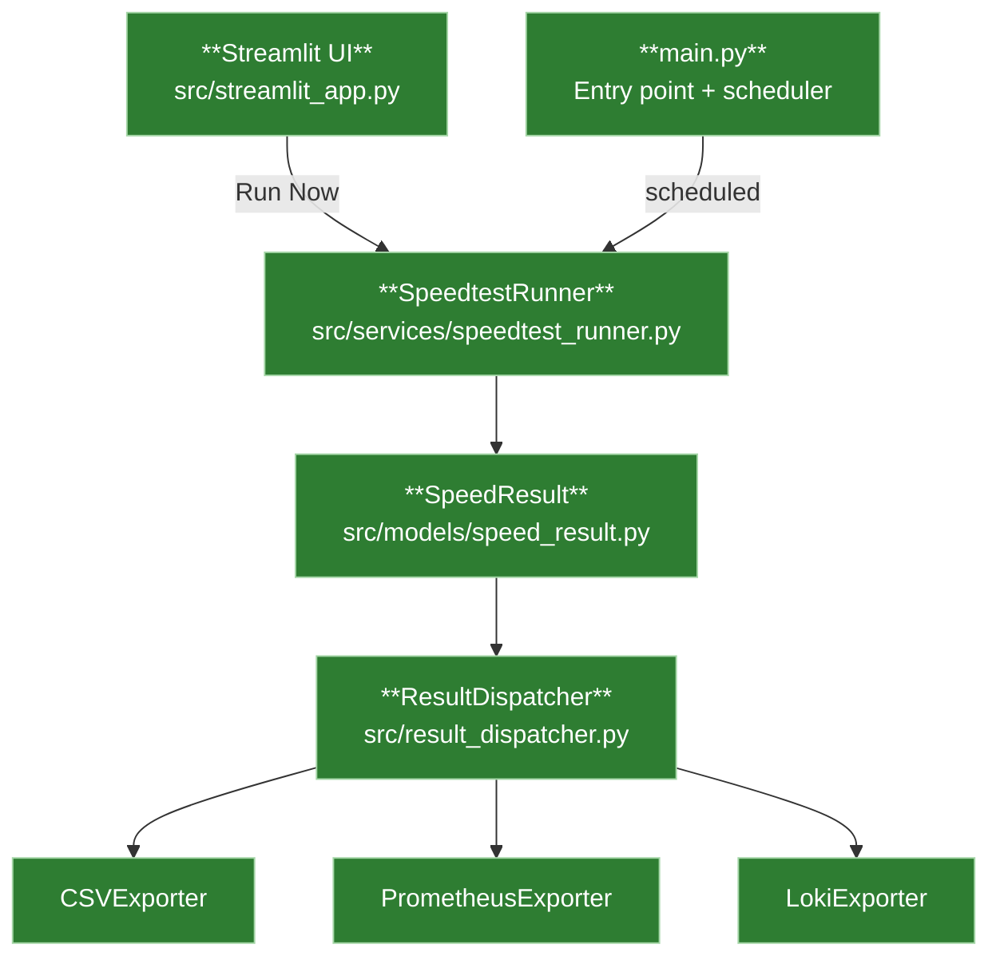

# Hermes

A Python application that periodically runs internet speed tests and exports results to multiple destinations (CSV, Prometheus, Loki/OTel), with a browser-based UI to trigger runs and view results.

## Architecture
  *Hermes is currently an alpha release. The core functionality works but the Prometheus and Loki connectors are still under development.*

### Data Flow



## Project Structure

```
Hermes/
├── src/
│   ├── main.py                        # Entry point — wires scheduler, dispatcher, and exporters
│   ├── config.py                      # Static config loaded from environment variables
│   ├── runtime_config.py              # Persistent runtime state (interval, enabled exporters)
│   ├── result_dispatcher.py           # ResultDispatcher — fans out SpeedResult to exporters
│   ├── streamlit_app.py               # Streamlit UI — run tests, view history, configure
│   ├── models/
│   │   └── speed_result.py            # SpeedResult dataclass — shared data contract
│   ├── services/
│   │   ├── speedtest_runner.py        # SpeedtestRunner — runs test, returns SpeedResult
│   │   └── logging.py                 # Logging configuration
│   ├── exporters/
│   │   ├── base_exporter.py           # Abstract BaseExporter interface
│   │   ├── csv_exporter.py            # CSVExporter — appends rows to CSV log
│   │   ├── prometheus_exporter.py     # PrometheusExporter — updates Gauges, /metrics endpoint
│   │   └── loki_exporter.py           # LokiExporter — ships JSON log events via HTTP push
│   └── web/
│       └── app.py                     # Flask app (legacy, superseded by Streamlit UI)
├── tests/
│   ├── test_main.py
│   ├── test_csv_exporter.py
│   ├── test_loki_exporter.py
│   ├── test_result_dispatcher.py
│   └── test_runtime_config.py
├── .env.example                       # Example environment variables
├── docker-compose.yml                 # Dev compose file (builds from source)
├── Dockerfile
├── requirements.txt                   # Project dependencies
├── pytest.ini                         # pytest configuration
└── README.md
```

## Setup

1. **Create and activate a virtual environment**

   ```bash
   python -m venv .venv
   # Windows
   .venv\Scripts\activate
   # macOS/Linux
   source .venv/bin/activate
   ```

2. **Install dependencies**

   ```bash
   pip install -r requirements.txt
   ```

3. **Configure environment variables**

   ```bash
   copy .env.example .env
   ```

## Running the App

```bash
python -m src.main
```

Or use the **Run Hermes** task in VS Code (Terminal → Run Task).

## Running Tests

```bash
pytest
```

## Self-Hosting

Hermes is distributed as a Docker image on GHCR.

### Minimal setup

Create a `docker-compose.yml` on your server:

```yaml
services:
  hermes:
    image: ghcr.io/fabell4/hermes:latest
    container_name: hermes
    restart: unless-stopped
    ports:
      - "8501:8501"   # Streamlit UI
      - "8000:8000"   # Prometheus /metrics
    volumes:
      - hermes-logs:/app/logs
      - hermes-data:/app/data
    env_file:
      - .env

volumes:
  hermes-logs:
  hermes-data:
```

Create a `.env` alongside it. The `.env.example` in this repo lists every available variable with comments — copy it and adjust as needed:

```bash
curl -o .env https://raw.githubusercontent.com/fabell4/hermes/main/.env.example
```

Then start it:

```bash
docker compose up -d
```

The UI is available at `http://<server-ip>:8501`.
