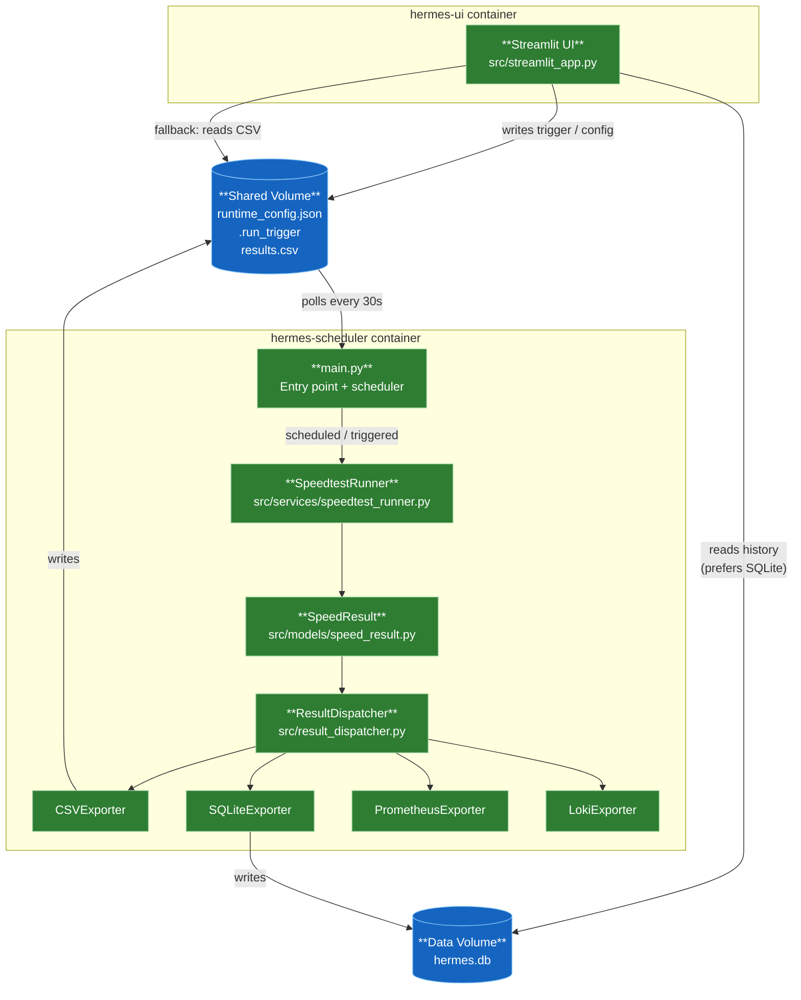
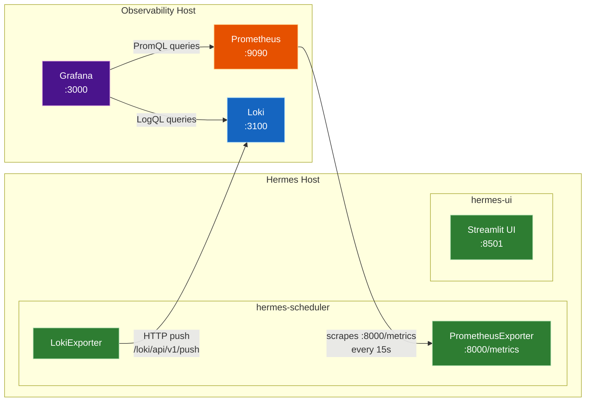

# Hermes

A Python application that periodically runs internet speed tests and exports results to multiple destinations (CSV, SQLite, Prometheus, and Loki), with a browser-based UI to trigger runs and view results. Each result captures download, upload, ping, jitter, and ISP name.

## Architecture
  *Hermes is currently an alpha release. All four exporters (CSV, SQLite, Prometheus, Loki) are fully operational.*

### Data Flow



### Deployment Topology



**Key integration notes:**
- **Prometheus** must have a scrape job targeting `<hermes-host>:8000` — Hermes does not push metrics, it exposes them for scraping
- **Loki URL** must be set via `LOKI_URL` env var (e.g. `http://loki:3100`) — Hermes pushes directly on each test run
- **Grafana** datasources must point to the Prometheus and Loki servers, not to Hermes directly
- The pre-built dashboard (`docs/grafana-dashboard.json`) can be imported via **+ → Import** and will prompt for both datasource bindings

## Project Structure

```
Hermes/
├── src/
│   ├── main.py                        # Entry point — wires scheduler, dispatcher, and exporters
│   ├── config.py                      # Static config loaded from environment variables
│   ├── runtime_config.py              # Persistent runtime state (interval, enabled exporters)
│   ├── result_dispatcher.py           # ResultDispatcher — fans out SpeedResult to exporters
│   ├── streamlit_app.py               # Streamlit UI — run tests, view history, configure
│   ├── models/
│   │   └── speed_result.py            # SpeedResult dataclass — shared data contract
│   ├── services/
│   │   ├── speedtest_runner.py        # SpeedtestRunner — runs test, returns SpeedResult
│   │   ├── health_server.py           # HealthServer — GET /health endpoint on HEALTH_PORT
│   │   └── logging.py                 # Logging configuration
│   ├── exporters/
│   │   ├── base_exporter.py           # Abstract BaseExporter interface
│   │   ├── csv_exporter.py            # CSVExporter — appends rows to CSV log
│   │   ├── prometheus_exporter.py     # PrometheusExporter — updates Gauges, /metrics endpoint
│   │   ├── loki_exporter.py           # LokiExporter — ships JSON log events via HTTP push
│   │   └── sqlite_exporter.py         # SQLiteExporter — stores results in hermes.db (WAL mode)
├── tests/
│   ├── test_main.py
│   ├── test_csv_exporter.py
│   ├── test_loki_exporter.py
│   ├── test_prometheus_exporter.py
│   ├── test_result_dispatcher.py
│   ├── test_runtime_config.py
│   └── test_sqlite_exporter.py
├── .env.example                       # Example environment variables
├── docker-compose.yml                 # Dev compose file (builds from source)
├── Dockerfile
├── requirements.txt                   # Project dependencies
├── pytest.ini                         # pytest configuration
└── README.md
```

## Setup

1. **Create and activate a virtual environment**

   ```bash
   python -m venv .venv
   # Windows
   .venv\Scripts\activate
   # macOS/Linux
   source .venv/bin/activate
   ```

2. **Install dependencies**

   ```bash
   pip install -r requirements.txt
   ```

3. **Configure environment variables**

   ```bash
   copy .env.example .env
   ```

## Running the App

```bash
python -m src.main
```

Or use the **Run Hermes** task in VS Code (Terminal → Run Task).

## Running Tests

```bash
pytest
```

## Self-Hosting

Hermes is distributed as a Docker image on GHCR.

### Minimal setup

Hermes runs as two containers from the same image — a scheduler and a UI. Create a `docker-compose.yml` on your server:

```yaml
services:
  hermes-scheduler:
    image: ghcr.io/fabell4/hermes:latest
    container_name: hermes-scheduler
    restart: always
    command: ["python", "-m", "src.main"]
    ports:
      - "8000:8000"   # Prometheus /metrics
      - "8080:8080"   # Health endpoint GET /health
    volumes:
      - hermes-logs:/app/logs
      - hermes-data:/app/data
    env_file:
      - .env

  hermes-ui:
    image: ghcr.io/fabell4/hermes:latest
    container_name: hermes-ui
    restart: always
    ports:
      - "8501:8501"   # Streamlit UI
    volumes:
      - hermes-logs:/app/logs
      - hermes-data:/app/data
    env_file:
      - .env
    depends_on:
      - hermes-scheduler

volumes:
  hermes-logs:
  hermes-data:
```

Create a `.env` alongside it. The `.env.example` in this repo lists every available variable with comments — copy it and adjust as needed:

```bash
curl -o .env https://raw.githubusercontent.com/fabell4/hermes/main/.env.example
```

Then start it:

```bash
docker compose up -d
```

The UI is available at `http://<server-ip>:8501`.

**Key `.env` variables for self-hosting:**

| Variable | Default | Description |
|---|---|---|
| `ENABLED_EXPORTERS` | `csv` | Comma-separated list: `csv`, `sqlite`, `prometheus`, `loki` |
| `SPEEDTEST_INTERVAL_MINUTES` | `60` | How often to run a speed test |
| `RUN_ON_STARTUP` | `true` | Run a test immediately on container start |
| `SQLITE_DB_PATH` | `data/hermes.db` | Path to the SQLite database file |
| `SQLITE_RETENTION_DAYS` | `0` (unlimited) | Prune rows older than N days |
| `SQLITE_MAX_ROWS` | `0` (unlimited) | Keep only the N most recent rows |
| `PROMETHEUS_PORT` | `8000` | Port for the `/metrics` scrape endpoint |
| `HEALTH_PORT` | `8080` | Port for the `GET /health` endpoint |
| `LOKI_URL` | *(unset)* | Full Loki push URL, e.g. `http://loki:3100` |

Enable SQLite for the best UI experience — the Streamlit dashboard reads from `hermes.db` when available and falls back to `results.csv` otherwise.
