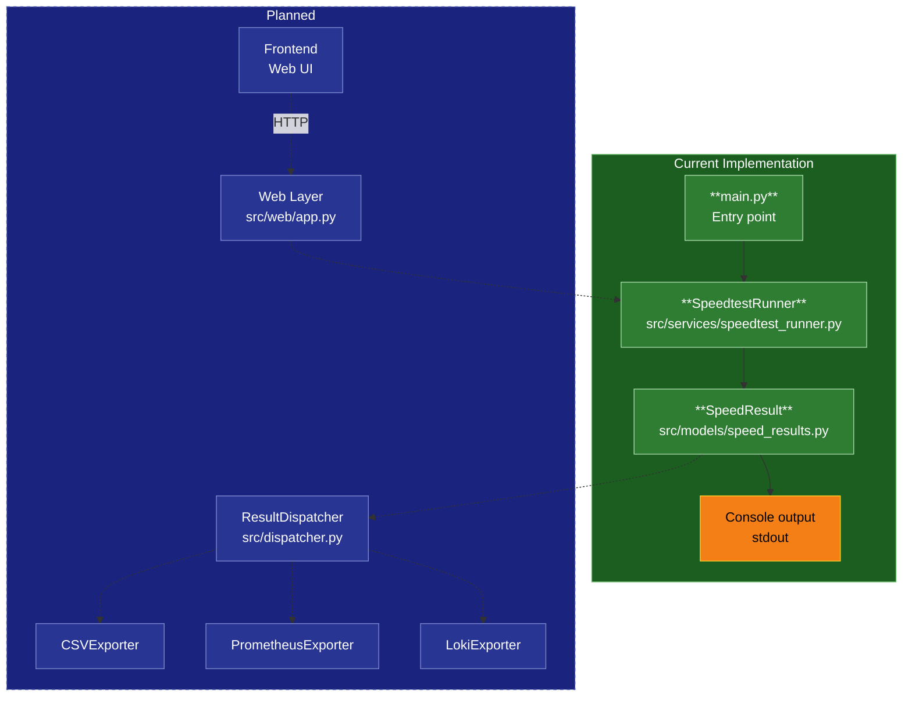

# Hermes

A Python application that periodically runs internet speed tests and exports results to multiple destinations (CSV, Prometheus, Loki/OTel), with a browser-based UI to trigger runs and view results.

## Architecture

### Data Flow

> Solid lines = implemented. Dashed lines = planned.



## Project Structure

```
Hermes/
├── src/
│   ├── main.py                        # Entry point — wires everything together,
│   │                                  #   starts scheduler + web server
│   ├── dispatcher.py                  # ResultDispatcher — fans out SpeedResult to exporters
│   ├── models/
│   │   └── speed_results.py           # SpeedResult dataclass — shared data contract
│   ├── services/
│   │   ├── speedtest_runner.py        # SpeedtestRunner — runs test, returns SpeedResult
│   │   └── logging.py                 # Logging configuration
│   ├── exporters/
│   │   ├── base_export.py             # Abstract BaseExporter interface
│   │   ├── csv_export.py              # CSVExporter — appends rows, serves file for download
│   │   ├── prometheus_exporter.py     # PrometheusExporter — updates Gauges, /metrics endpoint
│   │   └── loki_exporter.py           # LokiExporter — ships JSON log events via HTTP push
│   └── web/
│       ├── app.py                     # Flask app — routes only, no business logic
│       └── templates/
│           └── index.html             # Frontend UI
├── tests/
│   ├── __init__.py
│   └── test_main.py
├── .env.example                       # Example environment variables
├── requirements.txt                   # Project dependencies
├── pytest.ini                         # pytest configuration
└── README.md
```

## Setup

1. **Create and activate a virtual environment**

   ```bash
   python -m venv .venv
   # Windows
   .venv\Scripts\activate
   # macOS/Linux
   source .venv/bin/activate
   ```

2. **Install dependencies**

   ```bash
   pip install -r requirements.txt
   ```

3. **Configure environment variables**

   ```bash
   copy .env.example .env
   ```

## Running the App

```bash
python -m src.main
```

Or use the **Run Hermes** task in VS Code (Terminal → Run Task).

## Running Tests

```bash
pytest
```

Test
