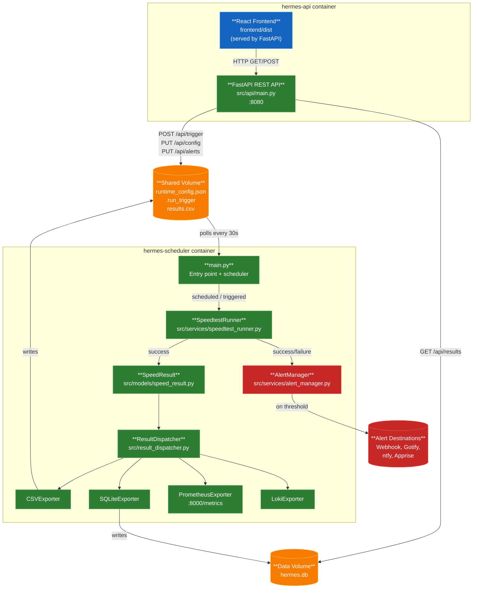
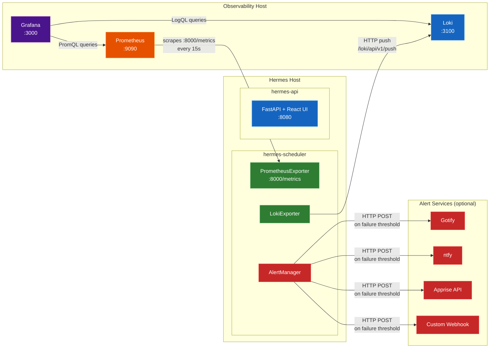

# Hermes

A Python application that periodically runs internet speed tests and exports results to multiple destinations (CSV, SQLite, Prometheus, and Loki). Results are surfaced through a React + Vite frontend backed by a FastAPI REST layer. Each result captures download, upload, ping, jitter, and ISP name.

**Alert notifications** can be configured to send alerts via webhook, Gotify, ntfy.sh, or Apprise (100+ services) when consecutive speedtest failures occur, with configurable thresholds and cooldown periods.

## Architecture
  *Hermes is currently in beta. All four exporters (CSV, SQLite, Prometheus, Loki) are fully operational.*

### Data Flow



### Deployment Topology



**Key integration notes:**
- **Prometheus** must have a scrape job targeting `<hermes-host>:8000` — Hermes does not push metrics, it exposes them for scraping
- **Loki URL** must be set via `LOKI_URL` env var (e.g. `http://loki:3100`) — Hermes pushes directly on each test run
- **Grafana** datasources must point to the Prometheus and Loki servers, not to Hermes directly
- The pre-built dashboard (`docs/grafana-dashboard.json`) can be imported via **+ → Import** and will prompt for both datasource bindings
- **Alert services** are optional and configured per provider — Hermes sends HTTP POST notifications when consecutive failure threshold is met

## Project Structure

```
Hermes/
├── src/
│   ├── main.py                        # Entry point — wires scheduler, dispatcher, and exporters
│   ├── config.py                      # Static config loaded from environment variables
│   ├── runtime_config.py              # Persistent runtime state (interval, enabled exporters)
│   ├── shared_state.py                # Shared state for alert_manager access across API
│   ├── result_dispatcher.py           # ResultDispatcher — fans out SpeedResult to exporters
│   ├── api/
│   │   ├── main.py                    # FastAPI app — REST API + React frontend serving
│   │   ├── auth.py                    # API key authentication and rate limiting
│   │   └── routes/                    # API endpoint modules (config, results, trigger, alerts)
│   ├── models/
│   │   └── speed_result.py            # SpeedResult dataclass — shared data contract
│   ├── services/
│   │   ├── speedtest_runner.py        # SpeedtestRunner — runs test, returns SpeedResult
│   │   ├── alert_manager.py           # AlertManager — tracks failures and sends alerts
│   │   ├── alert_providers.py         # Alert provider implementations (Webhook, Gotify, ntfy, Apprise)
│   │   ├── health_server.py           # Health check endpoint
│   │   └── log_service.py             # Logging configuration
│   ├── exporters/
│   │   ├── base_exporter.py           # Abstract BaseExporter interface
│   │   ├── csv_exporter.py            # CSVExporter — appends rows to CSV log
│   │   ├── prometheus_exporter.py     # PrometheusExporter — updates Gauges, /metrics endpoint
│   │   ├── loki_exporter.py           # LokiExporter — ships JSON log events via HTTP push
│   │   └── sqlite_exporter.py         # SQLiteExporter — stores results in hermes.db (WAL mode)
├── frontend/
│   ├── src/
│   │   ├── main.tsx                   # React app entry point
│   │   ├── pages/                     # Dashboard and Settings pages
│   │   ├── components/                # Reusable UI components
│   │   ├── context/                   # React context for global state
│   │   └── lib/                       # API client and utilities
│   ├── package.json                   # Frontend dependencies
│   └── vite.config.ts                 # Vite build configuration
├── tests/
│   ├── test_main.py
│   ├── test_api_*.py                  # FastAPI endpoint tests (including alerts)
│   ├── test_alert_manager.py
│   ├── test_alert_providers.py
│   ├── test_csv_exporter.py
│   ├── test_loki_exporter.py
│   ├── test_prometheus_exporter.py
│   ├── test_result_dispatcher.py
│   ├── test_runtime_config.py
│   └── test_sqlite_exporter.py
├── .env.example                       # Example environment variables
├── docker-compose.yml                 # Production deployment (two-container architecture)
├── Dockerfile                         # Multi-stage build (Python + Node.js)
├── requirements.txt                   # Python dependencies
├── pytest.ini                         # pytest configuration
└── README.md
```

## Setup

1. **Create and activate a virtual environment**

   ```bash
   python -m venv .venv
   # Windows
   .venv\Scripts\activate
   # macOS/Linux
   source .venv/bin/activate
   ```

2. **Install dependencies**

   ```bash
   pip install -r requirements.txt
   ```

3. **Configure environment variables**

   ```bash
   copy .env.example .env
   ```

4. **Install frontend dependencies**

   ```bash
   cd frontend && npm install
   ```

## Running the App

**Backend (scheduler):**

```bash
python -m src.main
```

**REST API:**

```bash
uvicorn src.api.main:app --port 8080 --reload
```

**Frontend dev server** (proxies API calls to `:8080` automatically):

```bash
cd frontend && npm run dev
```

Or use the **Run Hermes** / **Run Hermes UI** tasks in VS Code (Terminal → Run Task).

## Running Tests

```bash
# Python tests (with coverage report)
pytest

# Frontend type-check + lint
cd frontend && npm run type-check && npm run lint
```

## Self-Hosting

Hermes is distributed as a Docker image on GHCR.

### Minimal setup

Hermes runs as two containers from the same image — a scheduler (background worker) and an API server (REST + React frontend). Create a `docker-compose.yml` on your server:

```yaml
services:
  hermes-scheduler:
    image: ghcr.io/fabell4/hermes:latest
    container_name: hermes-scheduler
    restart: always
    command: ["python", "-m", "src.main"]
    ports:
      - "${PROMETHEUS_PORT:-8000}:8000" # Prometheus /metrics endpoint
    volumes:
      - hermes-logs:/app/logs           # CSV result history + hermes.log
      - hermes-data:/app/data           # runtime_config.json, .run_trigger, hermes.db
    environment:
      APP_ENV: "${APP_ENV:-production}"
      LOG_LEVEL: "${LOG_LEVEL:-INFO}"
      TZ: "${TZ:-UTC}"
      SPEEDTEST_INTERVAL_MINUTES: "${SPEEDTEST_INTERVAL_MINUTES:-60}"
      RUN_ON_STARTUP: "${RUN_ON_STARTUP:-true}"
      ENABLED_EXPORTERS: "${ENABLED_EXPORTERS:-csv}"
      CSV_LOG_PATH: "logs/results.csv"
      SQLITE_DB_PATH: "data/hermes.db"
      PROMETHEUS_PORT: "${PROMETHEUS_PORT:-8000}"
      LOKI_URL: "${LOKI_URL:-}"
      LOKI_JOB_LABEL: "${LOKI_JOB_LABEL:-hermes_speedtest}"
      # Alert configuration (optional) - see Alerts section
      ALERT_FAILURE_THRESHOLD: "${ALERT_FAILURE_THRESHOLD:-0}"
      ALERT_COOLDOWN_MINUTES: "${ALERT_COOLDOWN_MINUTES:-60}"
      ALERT_WEBHOOK_URL: "${ALERT_WEBHOOK_URL:-}"
      ALERT_GOTIFY_URL: "${ALERT_GOTIFY_URL:-}"
      ALERT_GOTIFY_TOKEN: "${ALERT_GOTIFY_TOKEN:-}"
      ALERT_GOTIFY_PRIORITY: "${ALERT_GOTIFY_PRIORITY:-5}"
      ALERT_NTFY_URL: "${ALERT_NTFY_URL:-https://ntfy.sh}"
      ALERT_NTFY_TOPIC: "${ALERT_NTFY_TOPIC:-}"
      ALERT_NTFY_TOKEN: "${ALERT_NTFY_TOKEN:-}"
      ALERT_NTFY_PRIORITY: "${ALERT_NTFY_PRIORITY:-3}"
      ALERT_NTFY_TAGS: "${ALERT_NTFY_TAGS:-warning,rotating_light}"
      ALERT_APPRISE_URL: "${ALERT_APPRISE_URL:-}"
    env_file:
      - path: .env
        required: false

  hermes-api:
    image: ghcr.io/fabell4/hermes:latest
    container_name: hermes-api
    restart: always
    ports:
      - "${API_PORT:-8080}:8080"        # FastAPI REST + React SPA
    volumes:
      - hermes-logs:/app/logs
      - hermes-data:/app/data
    environment:
      APP_ENV: "${APP_ENV:-production}"
      APP_VERSION: "${APP_VERSION:-dev}"
      LOG_LEVEL: "${LOG_LEVEL:-INFO}"
      TZ: "${TZ:-UTC}"
      SPEEDTEST_INTERVAL_MINUTES: "${SPEEDTEST_INTERVAL_MINUTES:-60}"
      ENABLED_EXPORTERS: "${ENABLED_EXPORTERS:-csv}"
      CSV_LOG_PATH: "logs/results.csv"
      SQLITE_DB_PATH: "data/hermes.db"
      API_KEY: "${API_KEY:-}"
      RATE_LIMIT_PER_MINUTE: "${RATE_LIMIT_PER_MINUTE:-60}"
    env_file:
      - path: .env
        required: false
    depends_on:
      - hermes-scheduler

volumes:
  hermes-logs:
    driver: local
  hermes-data:
    driver: local
```

Create a `.env` alongside it. The `.env.example` in this repo lists every available variable with comments — copy it and adjust as needed:

```bash
curl -o .env https://raw.githubusercontent.com/fabell4/hermes/main/.env.example
```

Then start it:

```bash
docker compose up -d
```

The **React UI** is available at `http://<server-ip>:8080`.

**Key `.env` variables for self-hosting:**

| Variable | Default | Description |
|---|---|---|
| `TZ` | `UTC` | IANA timezone name for log timestamps |
| `ENABLED_EXPORTERS` | `csv` | Comma-separated list: `csv`, `sqlite`, `prometheus`, `loki` |
| `SPEEDTEST_INTERVAL_MINUTES` | `60` | How often to run a speed test |
| `RUN_ON_STARTUP` | `true` | Run a test immediately on container start |
| `CSV_LOG_PATH` | `logs/results.csv` | Path to the CSV results file |
| `CSV_MAX_ROWS` | `0` (unlimited) | Maximum CSV rows to keep (oldest removed first) |
| `CSV_RETENTION_DAYS` | `0` (unlimited) | Delete CSV rows older than N days |
| `SQLITE_DB_PATH` | `data/hermes.db` | Path to the SQLite database file |
| `SQLITE_MAX_ROWS` | `0` (unlimited) | Maximum SQLite rows to keep (oldest removed first) |
| `SQLITE_RETENTION_DAYS` | `0` (unlimited) | Delete SQLite rows older than N days |
| `PROMETHEUS_PORT` | `8000` | Port for the `/metrics` scrape endpoint |
| `LOKI_URL` | *(unset)* | Full Loki push URL, e.g. `http://loki:3100` |
| `LOKI_JOB_LABEL` | `hermes_speedtest` | Job label for Loki log entries |
| `API_PORT` | `8080` | Host port to expose the FastAPI + React frontend on |
| `API_KEY` | *(unset)* | API key for authentication (disables auth if unset) |
| `RATE_LIMIT_PER_MINUTE` | `60` | Maximum write requests per API key per 60-second window |
| `ALERT_FAILURE_THRESHOLD` | `0` (disabled) | Consecutive failures before sending alert |
| `ALERT_COOLDOWN_MINUTES` | `60` | Minimum minutes between alerts |
| `ALERT_WEBHOOK_URL` | *(unset)* | Webhook URL for alert notifications |
| `ALERT_GOTIFY_URL` | *(unset)* | Gotify server URL |
| `ALERT_GOTIFY_TOKEN` | *(unset)* | Gotify application token |
| `ALERT_NTFY_TOPIC` | *(unset)* | ntfy.sh topic name |
| `ALERT_NTFY_TOKEN` | *(unset)* | ntfy.sh authentication token (optional) |
| `ALERT_APPRISE_URL` | *(unset)* | Apprise API URL with config ID (e.g., `https://apprise.example.com/notify/myconfig`) |

> **Note:** Alert provider settings can also be configured via the UI Settings page. See the [Alert Notifications](#alert-notifications) section for details.

**Enable SQLite for the best UI experience** — the React dashboard reads from `hermes.db` when available and falls back to `results.csv` otherwise. Add `sqlite` to `ENABLED_EXPORTERS`:

```bash
ENABLED_EXPORTERS=csv,sqlite
```

## Alert Notifications

Hermes can send alert notifications when speed tests fail consecutively. Alerts are configurable via:
- **UI Settings page** (recommended) — saves to `data/runtime_config.json`
- **Environment variables** — set before first run (requires restart to change)

### Supported Alert Providers

| Provider | Description | Setup |
|---|---|---|
| **Webhook** | POST JSON to any HTTP endpoint | Provide webhook URL |
| **Gotify** | Self-hosted push notifications ([gotify.net](https://gotify.net)) | Gotify server URL + app token |
| **ntfy** | Simple pub-sub notifications ([ntfy.sh](https://ntfy.sh)) | Topic name (optionally with auth token) |
| **Apprise** | 100+ services via Apprise API ([caronc/apprise-api](https://github.com/caronc/apprise-api)) | Apprise API URL with config ID |

### Configuration via Environment Variables

Add to your `.env` file:

```bash
# Enable alerting (set threshold > 0)
ALERT_FAILURE_THRESHOLD=3          # Send alert after 3 consecutive failures
ALERT_COOLDOWN_MINUTES=60          # Minimum 60 minutes between alerts

# Example: Apprise (recommended for multiple recipients)
ALERT_APPRISE_URL=https://apprise.example.com/notify/myconfig

# Example: ntfy
ALERT_NTFY_TOPIC=hermes_alerts
ALERT_NTFY_TOKEN=tk_xxxxxxxxxxxxx
ALERT_NTFY_PRIORITY=3
ALERT_NTFY_TAGS=warning,rotating_light

# Example: Gotify
ALERT_GOTIFY_URL=https://gotify.example.com
ALERT_GOTIFY_TOKEN=your_app_token
ALERT_GOTIFY_PRIORITY=5

# Example: Webhook
ALERT_WEBHOOK_URL=https://your-webhook.example.com/alerts
```

### Configuration via UI

The Settings page provides a visual interface to configure alerts:

1. Navigate to **Settings → Alerts**
2. Toggle alerts **ON** and set failure threshold and cooldown
3. Enable desired providers and fill in their settings
4. Use **"Send Test Notification"** to verify configuration
5. Click **"Save Settings"** to persist

**Apprise with persistent config (recommended):**
- Set **URL** to `https://apprise.example.com/notify/myconfig`
- Leave **Service URLs** empty
- Manage recipients in Apprise's web UI

**Apprise with stateless mode:**
- Set **URL** to `https://apprise.example.com`
- Add service URLs (one per line):
  ```
  ntfys://ntfy.example.com/topic?token=tk_xxx
  gotify://gotify.example.com/token
  ```

### Alert API Endpoints

| Method | Path | Description |
|---|---|---|
| `GET` | `/api/alerts` | Get current alert configuration |
| `PUT` | `/api/alerts` | Update alert configuration (requires API key) |
| `POST` | `/api/alerts/test` | Send test notification (requires API key) |

See the `.env.example` file for all available alert environment variables and detailed comments.

## API Endpoints

The FastAPI server (`hermes-api` container) exposes the following REST endpoints on port `8080`:

### Public Endpoints (no authentication required)

| Method | Path | Description |
|---|---|---|
| `GET` | `/api/health` | Health check and scheduler status |
| `GET` | `/api/results` | Paginated speed test results (newest first) |
| `GET` | `/api/results/latest` | Most recent speed test result |
| `GET` | `/api/config` | Current runtime configuration |
| `GET` | `/api/alerts` | Current alert configuration (see Alerts section above) |
| `GET` | `/api/trigger/status` | Check if a speed test is currently running |

### Protected Endpoints (require `X-Api-Key` header when `API_KEY` is set)

| Method | Path | Description |
|---|---|---|
| `POST` | `/api/trigger` | Manually trigger a speed test |
| `PUT` | `/api/config` | Update runtime configuration |
| `PUT` | `/api/alerts` | Update alert configuration (see Alerts section above) |
| `POST` | `/api/alerts/test` | Send test notification to configured providers |

**Authentication:**

When `API_KEY` is set in `.env`, protected endpoints require an `X-Api-Key` header with the matching value:

```bash
curl -X POST http://localhost:8080/api/trigger \
  -H "X-Api-Key: your-api-key-here"
```

Generate a secure API key:
```bash
openssl rand -hex 32
```

**Rate Limiting:**

When authentication is enabled, write endpoints are rate-limited per API key (default: 60 requests per 60-second window). Adjust with `RATE_LIMIT_PER_MINUTE` in `.env`.

**Example API Calls:**

```bash
# Get latest result
curl http://localhost:8080/api/results/latest

# Get paginated results (page 1, 50 items)
curl http://localhost:8080/api/results?page=1&page_size=50

# Check if test is running
curl http://localhost:8080/api/trigger/status

# Trigger a manual test (requires API key if auth enabled)
curl -X POST http://localhost:8080/api/trigger \
  -H "X-Api-Key: your-api-key-here"

# Update configuration (requires API key if auth enabled)
curl -X PUT http://localhost:8080/api/config \
  -H "X-Api-Key: your-api-key-here" \
  -H "Content-Type: application/json" \
  -d '{"speedtest_interval_minutes": 30}'
```

## Security

Hermes implements multiple layers of security for production deployments:

### Security Features

- **API Key Authentication** — Optional `API_KEY` environment variable protects write endpoints (32-character minimum enforced at startup)
- **Rate Limiting** — Per-API-key sliding window rate limiting (60 requests per 60 seconds by default) with `Retry-After` headers
- **SSRF Protection** — Alert URLs validated to block internal network access, cloud metadata endpoints, and non-HTTP schemes
- **Request Size Limits** — 1 MB default body size limit to prevent DoS attacks
- **Security Headers** — `X-Frame-Options`, `X-Content-Type-Options`, `Cross-Origin-Resource-Policy`, `Referrer-Policy`
- **Configurable CORS** — Restrict frontend origins via `CORS_ORIGINS` environment variable
- **Input Validation** — Pydantic models enforce strict type checking and range validation on all API inputs
- **Timing-Safe Comparisons** — API key validation uses `secrets.compare_digest()` to prevent timing attacks

### Security Documentation

- **[Security Audit Report](docs/SECURITY-AUDIT.md)** — Comprehensive 50-page security analysis covering authentication, rate limiting, input validation, SSRF risks, and threat modeling
- **[Security Enhancements Summary](docs/SECURITY-ENHANCEMENTS.md)** — Implementation details of security fixes applied for v1.0 release

### Security Best Practices

**For production deployments:**

1. **Always set `API_KEY`** — Generate a secure key with:
   ```bash
   python -c 'import secrets; print(secrets.token_urlsafe(32))'
   ```

2. **Use HTTPS** — Deploy behind a reverse proxy (nginx, Caddy, Traefik) with TLS certificates

3. **Restrict CORS origins** — Set `CORS_ORIGINS` to your frontend domain only:
   ```bash
   CORS_ORIGINS=https://your-frontend-domain.com
   ```

4. **Configure rate limits** — Adjust `RATE_LIMIT_PER_MINUTE` based on your usage patterns

5. **Validate alert URLs** — Only use trusted, public HTTPS endpoints for alert webhooks

6. **Network isolation** — Deploy in a private network segment if possible; expose only necessary ports

7. **Monitor logs** — Review authentication failures and rate limit violations regularly

### Test Coverage

130+ API security tests validate:
- Authentication and authorization flows
- Rate limiting behavior
- SSRF protection (15 comprehensive tests)
- Input validation and boundary conditions
- Request size limits
- Test alert rate limiting

---

Licensed under MIT. See [LICENSE](LICENSE) for details.

