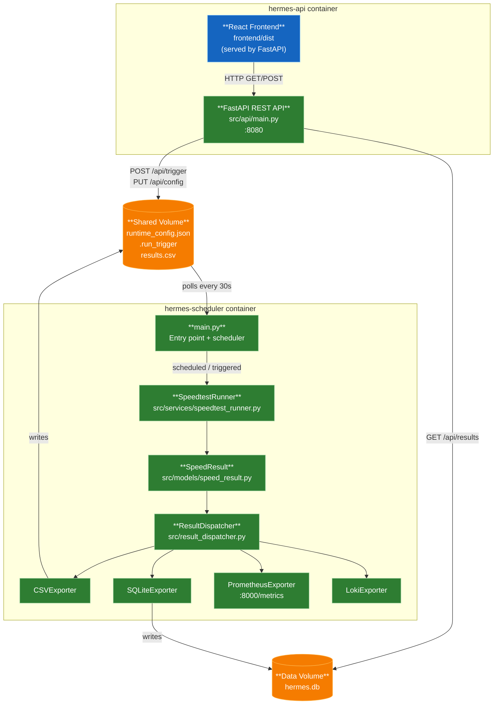
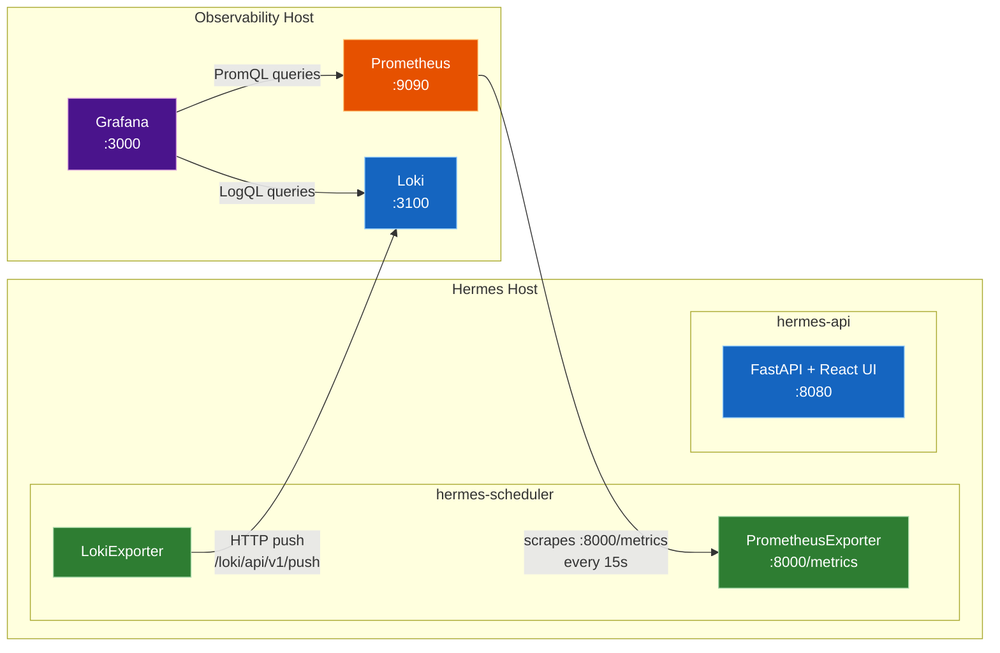

# Hermes

A Python application that periodically runs internet speed tests and exports results to multiple destinations (CSV, SQLite, Prometheus, and Loki). Results are surfaced through a React + Vite frontend backed by a FastAPI REST layer, and a legacy Streamlit UI is retained for compatibility. Each result captures download, upload, ping, jitter, and ISP name.

## Architecture
  *Hermes is currently an alpha release. All four exporters (CSV, SQLite, Prometheus, Loki) are fully operational.*

### Data Flow



### Deployment Topology



**Key integration notes:**
- **Prometheus** must have a scrape job targeting `<hermes-host>:8000` — Hermes does not push metrics, it exposes them for scraping
- **Loki URL** must be set via `LOKI_URL` env var (e.g. `http://loki:3100`) — Hermes pushes directly on each test run
- **Grafana** datasources must point to the Prometheus and Loki servers, not to Hermes directly
- The pre-built dashboard (`docs/grafana-dashboard.json`) can be imported via **+ → Import** and will prompt for both datasource bindings

## Project Structure

```
Hermes/
├── src/
│   ├── main.py                        # Entry point — wires scheduler, dispatcher, and exporters
│   ├── config.py                      # Static config loaded from environment variables
│   ├── runtime_config.py              # Persistent runtime state (interval, enabled exporters)
│   ├── result_dispatcher.py           # ResultDispatcher — fans out SpeedResult to exporters
│   ├── streamlit_app.py               # Streamlit UI — run tests, view history, configure
│   ├── models/
│   │   └── speed_result.py            # SpeedResult dataclass — shared data contract
│   ├── services/
│   │   ├── speedtest_runner.py        # SpeedtestRunner — runs test, returns SpeedResult
│   │   ├── health_server.py           # HealthServer — GET /health endpoint on HEALTH_PORT
│   │   └── logging.py                 # Logging configuration
│   ├── exporters/
│   │   ├── base_exporter.py           # Abstract BaseExporter interface
│   │   ├── csv_exporter.py            # CSVExporter — appends rows to CSV log
│   │   ├── prometheus_exporter.py     # PrometheusExporter — updates Gauges, /metrics endpoint
│   │   ├── loki_exporter.py           # LokiExporter — ships JSON log events via HTTP push
│   │   └── sqlite_exporter.py         # SQLiteExporter — stores results in hermes.db (WAL mode)
├── tests/
│   ├── test_main.py
│   ├── test_csv_exporter.py
│   ├── test_loki_exporter.py
│   ├── test_prometheus_exporter.py
│   ├── test_result_dispatcher.py
│   ├── test_runtime_config.py
│   └── test_sqlite_exporter.py
├── .env.example                       # Example environment variables
├── docker-compose.yml                 # Dev compose file (builds from source)
├── Dockerfile
├── requirements.txt                   # Project dependencies
├── pytest.ini                         # pytest configuration
└── README.md
```

## Setup

1. **Create and activate a virtual environment**

   ```bash
   python -m venv .venv
   # Windows
   .venv\Scripts\activate
   # macOS/Linux
   source .venv/bin/activate
   ```

2. **Install dependencies**

   ```bash
   pip install -r requirements.txt
   ```

3. **Configure environment variables**

   ```bash
   copy .env.example .env
   ```

4. **Install frontend dependencies**

   ```bash
   cd frontend && npm install
   ```

## Running the App

**Backend (scheduler):**

```bash
python -m src.main
```

**REST API:**

```bash
uvicorn src.api.main:app --port 8080 --reload
```

**Frontend dev server** (proxies API calls to `:8080` automatically):

```bash
cd frontend && npm run dev
```

Or use the **Run Hermes** / **Run Hermes UI** tasks in VS Code (Terminal → Run Task).

## Running Tests

```bash
# Python tests (with coverage report)
pytest

# Frontend type-check + lint
cd frontend && npm run type-check && npm run lint
```

## Self-Hosting

Hermes is distributed as a Docker image on GHCR.

### Minimal setup

Hermes runs as two containers from the same image — a scheduler (background worker) and an API server (REST + React frontend). Create a `docker-compose.yml` on your server:

```yaml
services:
  hermes-scheduler:
    image: ghcr.io/fabell4/hermes:latest
    container_name: hermes-scheduler
    restart: always
    command: ["python", "-m", "src.main"]
    ports:
      - "${PROMETHEUS_PORT:-8000}:8000" # Prometheus /metrics endpoint
    volumes:
      - hermes-logs:/app/logs           # CSV result history + hermes.log
      - hermes-data:/app/data           # runtime_config.json, .run_trigger, hermes.db
    environment:
      APP_ENV: "${APP_ENV:-production}"
      LOG_LEVEL: "${LOG_LEVEL:-INFO}"
      TZ: "${TZ:-UTC}"
      SPEEDTEST_INTERVAL_MINUTES: "${SPEEDTEST_INTERVAL_MINUTES:-60}"
      RUN_ON_STARTUP: "${RUN_ON_STARTUP:-true}"
      ENABLED_EXPORTERS: "${ENABLED_EXPORTERS:-csv}"
      CSV_LOG_PATH: "logs/results.csv"
      SQLITE_DB_PATH: "data/hermes.db"
      PROMETHEUS_PORT: "${PROMETHEUS_PORT:-8000}"
      LOKI_URL: "${LOKI_URL:-}"
      LOKI_JOB_LABEL: "${LOKI_JOB_LABEL:-hermes_speedtest}"
    env_file:
      - path: .env
        required: false

  hermes-api:
    image: ghcr.io/fabell4/hermes:latest
    container_name: hermes-api
    restart: always
    ports:
      - "${API_PORT:-8080}:8080"        # FastAPI REST + React SPA
    volumes:
      - hermes-logs:/app/logs
      - hermes-data:/app/data
    environment:
      APP_ENV: "${APP_ENV:-production}"
      APP_VERSION: "${APP_VERSION:-dev}"
      LOG_LEVEL: "${LOG_LEVEL:-INFO}"
      TZ: "${TZ:-UTC}"
      SPEEDTEST_INTERVAL_MINUTES: "${SPEEDTEST_INTERVAL_MINUTES:-60}"
      ENABLED_EXPORTERS: "${ENABLED_EXPORTERS:-csv}"
      CSV_LOG_PATH: "logs/results.csv"
      SQLITE_DB_PATH: "data/hermes.db"
      API_KEY: "${API_KEY:-}"
      RATE_LIMIT_PER_MINUTE: "${RATE_LIMIT_PER_MINUTE:-60}"
    env_file:
      - path: .env
        required: false
    depends_on:
      - hermes-scheduler

volumes:
  hermes-logs:
    driver: local
  hermes-data:
    driver: local
```

Create a `.env` alongside it. The `.env.example` in this repo lists every available variable with comments — copy it and adjust as needed:

```bash
curl -o .env https://raw.githubusercontent.com/fabell4/hermes/main/.env.example
```

Then start it:

```bash
docker compose up -d
```

The **React UI** is available at `http://<server-ip>:8080`.

**Key `.env` variables for self-hosting:**

| Variable | Default | Description |
|---|---|---|
| `TZ` | `UTC` | IANA timezone name for log timestamps |
| `ENABLED_EXPORTERS` | `csv` | Comma-separated list: `csv`, `sqlite`, `prometheus`, `loki` |
| `SPEEDTEST_INTERVAL_MINUTES` | `60` | How often to run a speed test |
| `RUN_ON_STARTUP` | `true` | Run a test immediately on container start |
| `CSV_LOG_PATH` | `logs/results.csv` | Path to the CSV results file |
| `CSV_MAX_ROWS` | `0` (unlimited) | Maximum CSV rows to keep (oldest removed first) |
| `CSV_RETENTION_DAYS` | `0` (unlimited) | Delete CSV rows older than N days |
| `SQLITE_DB_PATH` | `data/hermes.db` | Path to the SQLite database file |
| `SQLITE_MAX_ROWS` | `0` (unlimited) | Maximum SQLite rows to keep (oldest removed first) |
| `SQLITE_RETENTION_DAYS` | `0` (unlimited) | Delete SQLite rows older than N days |
| `PROMETHEUS_PORT` | `8000` | Port for the `/metrics` scrape endpoint |
| `LOKI_URL` | *(unset)* | Full Loki push URL, e.g. `http://loki:3100` |
| `LOKI_JOB_LABEL` | `hermes_speedtest` | Job label for Loki log entries |
| `API_PORT` | `8080` | Host port to expose the FastAPI + React frontend on |
| `API_KEY` | *(unset)* | API key for authentication (disables auth if unset) |
| `RATE_LIMIT_PER_MINUTE` | `60` | Maximum write requests per API key per 60-second window |

**Enable SQLite for the best UI experience** — the React dashboard reads from `hermes.db` when available and falls back to `results.csv` otherwise. Add `sqlite` to `ENABLED_EXPORTERS`:

```bash
ENABLED_EXPORTERS=csv,sqlite
```

## API Endpoints

The FastAPI server (`hermes-api` container) exposes the following REST endpoints on port `8080`:

### Public Endpoints (no authentication required)

| Method | Path | Description |
|---|---|---|
| `GET` | `/api/health` | Health check and scheduler status |
| `GET` | `/api/results` | Paginated speed test results (newest first) |
| `GET` | `/api/results/latest` | Most recent speed test result |
| `GET` | `/api/config` | Current runtime configuration |
| `GET` | `/api/trigger/status` | Check if a speed test is currently running |

### Protected Endpoints (require `X-Api-Key` header when `API_KEY` is set)

| Method | Path | Description |
|---|---|---|
| `POST` | `/api/trigger` | Manually trigger a speed test |
| `PUT` | `/api/config` | Update runtime configuration |

**Authentication:**

When `API_KEY` is set in `.env`, protected endpoints require an `X-Api-Key` header with the matching value:

```bash
curl -X POST http://localhost:8080/api/trigger \
  -H "X-Api-Key: your-api-key-here"
```

Generate a secure API key:
```bash
openssl rand -hex 32
```

**Rate Limiting:**

When authentication is enabled, write endpoints are rate-limited per API key (default: 60 requests per 60-second window). Adjust with `RATE_LIMIT_PER_MINUTE` in `.env`.

**Example API Calls:**

```bash
# Get latest result
curl http://localhost:8080/api/results/latest

# Get paginated results (page 1, 50 items)
curl http://localhost:8080/api/results?page=1&page_size=50

# Check if test is running
curl http://localhost:8080/api/trigger/status

# Trigger a manual test (requires API key if auth enabled)
curl -X POST http://localhost:8080/api/trigger \
  -H "X-Api-Key: your-api-key-here"

# Update configuration (requires API key if auth enabled)
curl -X PUT http://localhost:8080/api/config \
  -H "X-Api-Key: your-api-key-here" \
  -H "Content-Type: application/json" \
  -d '{"speedtest_interval_minutes": 30}'
```
