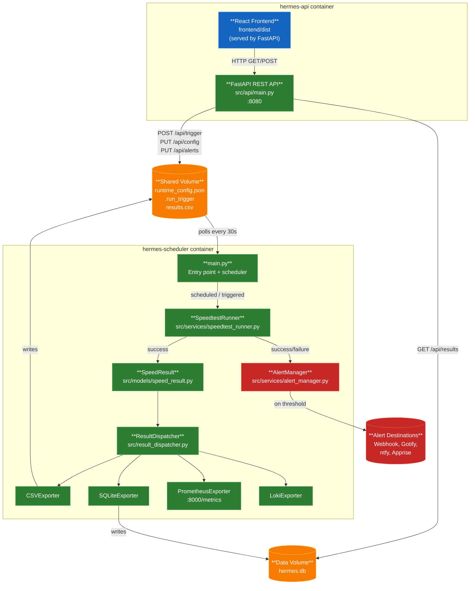
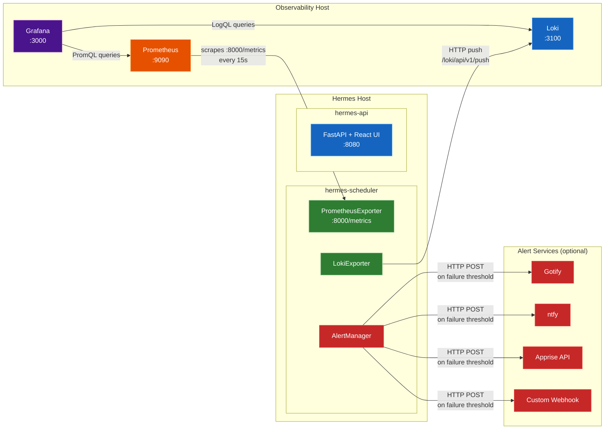

# Architecture Overview

Hermes is designed as a distributed two-container system that periodically runs internet speed tests and
exports results to multiple observability destinations.

---

## System Architecture

### Data Flow



### Deployment Topology



**Note:** Both containers use the same Docker image (`hermes:latest`) but with different entry points:

- **hermes-scheduler:** Runs `python -m src.main` (background worker with scheduler)
- **hermes-api:** Uses the default CMD which starts the FastAPI server

This single-image design simplifies builds and deployments while enabling flexible scaling of each service independently.

---

## Component Details

### hermes-scheduler Container

**Purpose:** Background worker that runs speed tests on schedule and exports results.

**Key Components:**

- **`main.py`** — Entry point, wires scheduler and watches for trigger file
- **`SpeedtestRunner`** — Executes official Ookla speedtest CLI and parses JSON results
- **`SpeedResult`** — Data model capturing download, upload, ping, jitter, ISP, timestamp
- **`ResultDispatcher`** — Fans out results to all enabled exporters
- **`AlertManager`** — Tracks consecutive failures and sends notifications
- **Exporters:** CSV, SQLite, Prometheus, Loki

**Exposed Ports:**

- `:8000` — Prometheus `/metrics` scrape endpoint

**Volumes:**

- `/app/logs` — CSV results and application logs
- `/app/data` — SQLite database, runtime config, trigger file

**Environment Variables:**

- `SPEEDTEST_INTERVAL_MINUTES` — Test frequency (default: 60)
- `RUN_ON_STARTUP` — Run test immediately on start (default: true)
- `ENABLED_EXPORTERS` — Comma-separated list: `csv`, `sqlite`, `prometheus`, `loki`
- `PROMETHEUS_PORT` — Port for metrics endpoint (default: 8000)
- `LOKI_URL` — Loki push endpoint (e.g., `http://loki:3100`)
- Alert configuration (see [Alerts](alerts))

### hermes-api Container

**Purpose:** FastAPI REST API serving the React frontend and providing programmatic access.

**Key Components:**

- **`src/api/main.py`** — FastAPI application with middleware
- **`src/api/auth.py`** — API key authentication and rate limiting
- **`src/api/routes/`** — Endpoint modules (config, results, trigger, alerts)
- **`frontend/dist`** — Built React SPA served as static files

**Exposed Ports:**

- `:8080` — HTTP API and frontend

**Volumes:**

- `/app/logs` — Shared CSV results (for fallback reads)
- `/app/data` — Shared SQLite database and runtime config

**Environment Variables:**

- `API_KEY` — Optional API key for auth (32+ chars, disables auth if unset)
- `RATE_LIMIT_PER_MINUTE` — Max write requests per API key per 60s (default: 60)
- `CORS_ORIGINS` — Comma-separated allowed origins (default: `http://localhost:5173,http://localhost:4173`)
- `MAX_REQUEST_BODY_SIZE` — Request size limit in bytes (default: 1048576 = 1 MB)

**Middleware:**

- **RequestSizeLimitMiddleware** — Rejects requests > `MAX_REQUEST_BODY_SIZE`
- **SecurityHeadersMiddleware** — Adds `X-Frame-Options`, `X-Content-Type-Options`, `Cross-Origin-Resource-Policy`, `Referrer-Policy`
- **CORSMiddleware** — Validates origins, restricts methods (GET, POST, PUT) and headers

---

## Data Models

### SpeedResult

Shared data contract between all components:

```python
@dataclass
class SpeedResult:
    download_mbps: float
    upload_mbps: float
    ping_ms: float
    jitter_ms: float
    isp: str
    timestamp: str  # ISO 8601 format
```

### Runtime Configuration

Stored in `data/runtime_config.json`, managed via API or UI:

```json
{
  "speedtest_interval_minutes": 60,
  "enabled_exporters": ["csv", "sqlite", "prometheus"],
  "alerts": {
    "enabled": true,
    "failure_threshold": 3,
    "cooldown_minutes": 60,
    "providers": {
      "webhook": { "enabled": false, "url": "" },
      "gotify": { "enabled": false, "url": "", "token": "", "priority": 5 },
      "ntfy": { "enabled": true, "url": "https://ntfy.sh", "topic": "hermes_alerts", "token": "", "priority": 3, "tags": "warning,rotating_light" },
      "apprise": { "enabled": false, "url": "", "urls": [] }
    }
  }
}
```

---

## Exporters

### CSV Exporter

**Path:** `logs/results.csv`

**Format:**

```csv
timestamp,download_mbps,upload_mbps,ping_ms,jitter_ms,isp
2026-04-29T12:00:00Z,250.5,35.2,15.3,2.1,Comcast
```

**Configuration:**

- `CSV_MAX_ROWS` — Limit total rows (oldest removed first)
- `CSV_RETENTION_DAYS` — Delete rows older than N days

**Use Case:** Simple log file for manual inspection or external processing.

### SQLite Exporter

**Path:** `data/hermes.db`

**Table Schema:**

```sql
CREATE TABLE results (
    id INTEGER PRIMARY KEY AUTOINCREMENT,
    timestamp TEXT NOT NULL,
    download_mbps REAL NOT NULL,
    upload_mbps REAL NOT NULL,
    ping_ms REAL NOT NULL,
    jitter_ms REAL NOT NULL,
    isp TEXT NOT NULL
);
CREATE INDEX idx_timestamp ON results(timestamp DESC);
```

**Configuration:**

- `SQLITE_MAX_ROWS` — Limit total rows (oldest removed first)
- `SQLITE_RETENTION_DAYS` — Delete rows older than N days
- Uses WAL (Write-Ahead Logging) mode for concurrency

**Use Case:** Primary storage for API and UI queries. Best performance for dashboard charts.

### Prometheus Exporter

**Endpoint:** `http://<hermes-host>:8000/metrics`

**Metrics:**

```text
hermes_download_mbps{isp="Comcast"} 250.5
hermes_upload_mbps{isp="Comcast"} 35.2
hermes_ping_ms{isp="Comcast"} 15.3
hermes_jitter_ms{isp="Comcast"} 2.1
hermes_last_test_timestamp{isp="Comcast"} 1714396800
hermes_test_failure{isp="Comcast"} 0
```

**Configuration:**

- `PROMETHEUS_PORT` — Port for `/metrics` endpoint (default: 8000)

**Integration:**

```yaml
scrape_configs:
  - job_name: 'hermes'
    scrape_interval: 15s
    static_configs:
      - targets: ['hermes-scheduler:8000']
```

**Use Case:** Time-series metrics for Grafana dashboards, alerting rules, long-term retention.

### Loki Exporter

**Endpoint:** Pushes to `http://<loki-host>:3100/loki/api/v1/push`

**Log Format:**

```json
{
  "streams": [{
    "stream": {
      "job": "hermes_speedtest",
      "isp": "Comcast",
      "level": "info"
    },
    "values": [
      ["1714396800000000000", "{\"download_mbps\": 250.5, \"upload_mbps\": 35.2, \"ping_ms\": 15.3, \"jitter_ms\": 2.1, \"isp\": \"Comcast\", \"timestamp\": \"2026-04-29T12:00:00Z\"}"]
    ]
  }]
}
```

**Configuration:**

- `LOKI_URL` — Loki push endpoint (e.g., `http://loki:3100`)
- `LOKI_JOB_LABEL` — Job label for log entries (default: `hermes_speedtest`)

**Use Case:** Structured logs for LogQL queries in Grafana, correlation with other application logs.

---

## Alert System

### AlertManager Component

**Purpose:** Tracks consecutive test failures and sends notifications when threshold is met.

**Behavior:**

- Maintains failure counter across test runs
- Resets counter on successful test
- Sends alerts when `failure_count >= ALERT_FAILURE_THRESHOLD`
- Enforces cooldown period (`ALERT_COOLDOWN_MINUTES`) after each alert
- Supports multiple simultaneous providers

**Providers:**

- **Webhook** — POST JSON to custom HTTP endpoint
- **Gotify** — Self-hosted push notifications
- **ntfy** — Simple pub-sub notifications
- **Apprise** — 100+ services via Apprise API

**Configuration:**

- Via UI Settings page (recommended)
- Via environment variables
- Stored in `data/runtime_config.json`

See [Alert Configuration](alerts) for detailed setup guides.

---

## Integration Points

### Prometheus Integration

**Hermes exposes metrics** for Prometheus scraping:

1. **Configure Prometheus scrape job:**

   ```yaml
   scrape_configs:
     - job_name: 'hermes'
       scrape_interval: 15s
       static_configs:
         - targets: ['hermes-scheduler:8000']
   ```

2. **Verify metrics:**

   ```bash
   curl http://localhost:8000/metrics
   ```

3. **Query in Grafana with PromQL:**

   ```text
   hermes_download_mbps{job="hermes"}
   ```

### Loki Integration

**Hermes pushes logs** directly to Loki:

1. **Set `LOKI_URL` environment variable:**

   ```bash
   LOKI_URL=http://loki:3100
   ```

2. **Enable loki exporter:**

   ```bash
   ENABLED_EXPORTERS=csv,sqlite,loki
   ```

3. **Query in Grafana with LogQL:**

   ```text
   {job="hermes_speedtest"} | json | download_mbps > 100
   ```

### Grafana Dashboard

**Import pre-built dashboard:**

1. Download `docs/grafana-dashboard.json`
2. In Grafana: **+ → Import → Upload JSON file**
3. Select Prometheus and Loki datasources
4. Dashboard includes:

   - Download/upload trend charts
   - Ping/jitter statistics
   - Test failure annotations
   - ISP labels

---

## Project Structure

```text
Hermes/
├── src/
│   ├── main.py                        # Entry point — wires scheduler, dispatcher, and exporters
│   ├── config.py                      # Static config loaded from environment variables
│   ├── constants.py                   # Centralized constants for exporters and alert providers
│   ├── runtime_config.py              # Persistent runtime state (interval, enabled exporters)
│   ├── shared_state.py                # Shared state for alert_manager access across API
│   ├── result_dispatcher.py           # ResultDispatcher — fans out SpeedResult to exporters
│   ├── api/
│   │   ├── main.py                    # FastAPI app — REST API + React frontend serving
│   │   ├── auth.py                    # API key authentication and rate limiting
│   │   └── routes/                    # API endpoint modules (config, results, trigger, alerts)
│   ├── models/
│   │   └── speed_result.py            # SpeedResult dataclass — shared data contract
│   ├── services/
│   │   ├── speedtest_runner.py        # SpeedtestRunner — runs test, returns SpeedResult
│   │   ├── alert_manager.py           # AlertManager — tracks failures and sends alerts
│   │   ├── alert_providers.py         # Alert provider implementations (Webhook, Gotify, ntfy, Apprise)
│   │   ├── alert_provider_factory.py  # Shared alert provider registration logic
│   │   ├── health_server.py           # Health check endpoint
│   │   └── log_service.py             # Logging configuration
│   ├── exporters/
│   │   ├── base_exporter.py           # Abstract BaseExporter interface
│   │   ├── csv_exporter.py            # CSVExporter — appends rows to CSV log
│   │   ├── prometheus_exporter.py     # PrometheusExporter — updates Gauges, /metrics endpoint
│   │   ├── loki_exporter.py           # LokiExporter — ships JSON log events via HTTP push
│   │   └── sqlite_exporter.py         # SQLiteExporter — stores results in hermes.db (WAL mode)
├── frontend/
│   ├── src/
│   │   ├── main.tsx                   # React app entry point
│   │   ├── pages/                     # Dashboard and Settings pages
│   │   ├── components/                # Reusable UI components
│   │   ├── context/                   # React context for global state
│   │   └── lib/                       # API client and utilities
│   ├── package.json                   # Frontend dependencies
│   └── vite.config.ts                 # Vite build configuration
├── tests/
│   ├── test_main.py
│   ├── test_api_*.py                  # FastAPI endpoint tests (including alerts)
│   ├── test_alert_manager.py
│   ├── test_alert_providers.py
│   ├── test_csv_exporter.py
│   ├── test_loki_exporter.py
│   ├── test_prometheus_exporter.py
│   ├── test_result_dispatcher.py
│   ├── test_runtime_config.py
│   └── test_sqlite_exporter.py
├── .env.example                       # Example environment variables
├── docker-compose.yml                 # Production deployment (two-container architecture)
├── Dockerfile                         # Multi-stage build (Python + Node.js)
├── requirements.txt                   # Python dependencies
├── pytest.ini                         # pytest configuration
└── README.md
```

---

## Design Principles

### Separation of Concerns

- **Scheduler container** handles test execution and data export
- **API container** handles user interaction and REST access
- Clear boundaries via shared volumes

### Multi-Destination Export

- Single test result dispatched to multiple exporters
- Exporters are independent — one failure doesn't affect others
- Configurable via runtime settings

### Stateless API

- API reads shared data (SQLite, CSV) but doesn't run tests
- Triggers are file-based (`.run_trigger`) for container isolation
- Runtime config stored in JSON, not in-memory

### Defense in Depth

- Multiple security layers (auth, rate limiting, SSRF protection, size limits)
- Input validation at API boundary
- Security headers on all responses

### Observability First

- Native Prometheus metrics exposure
- Native Loki log pushing
- Pre-built Grafana dashboard
- Health check endpoints

---

## See Also

- [Getting Started](getting-started) — Deployment and configuration
- [API Reference](api-reference) — REST endpoints and examples
- [Security Guide](security) — Production security best practices
- [Alert Configuration](alerts) — Failure notification setup
